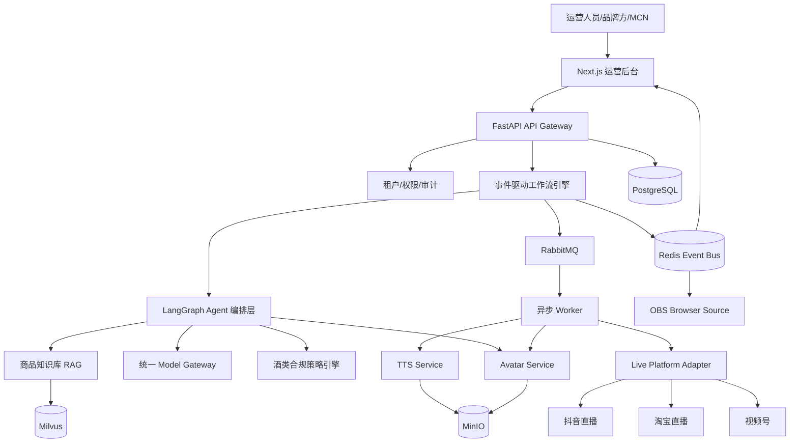
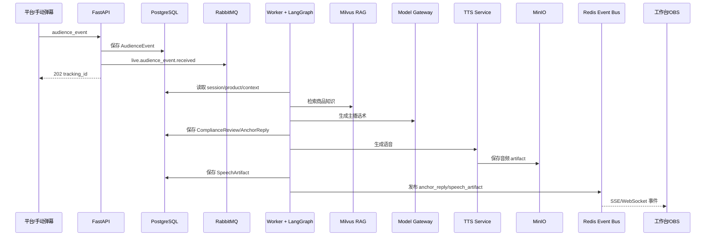
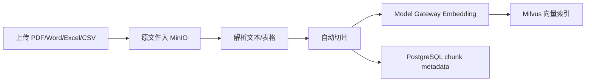
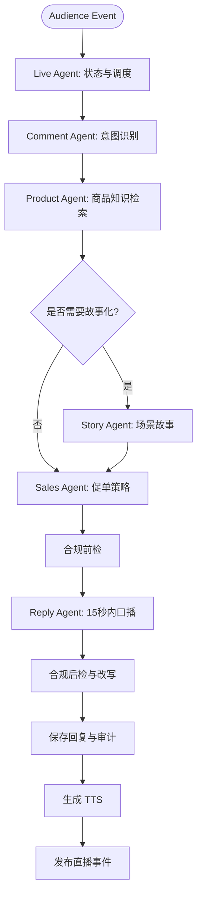
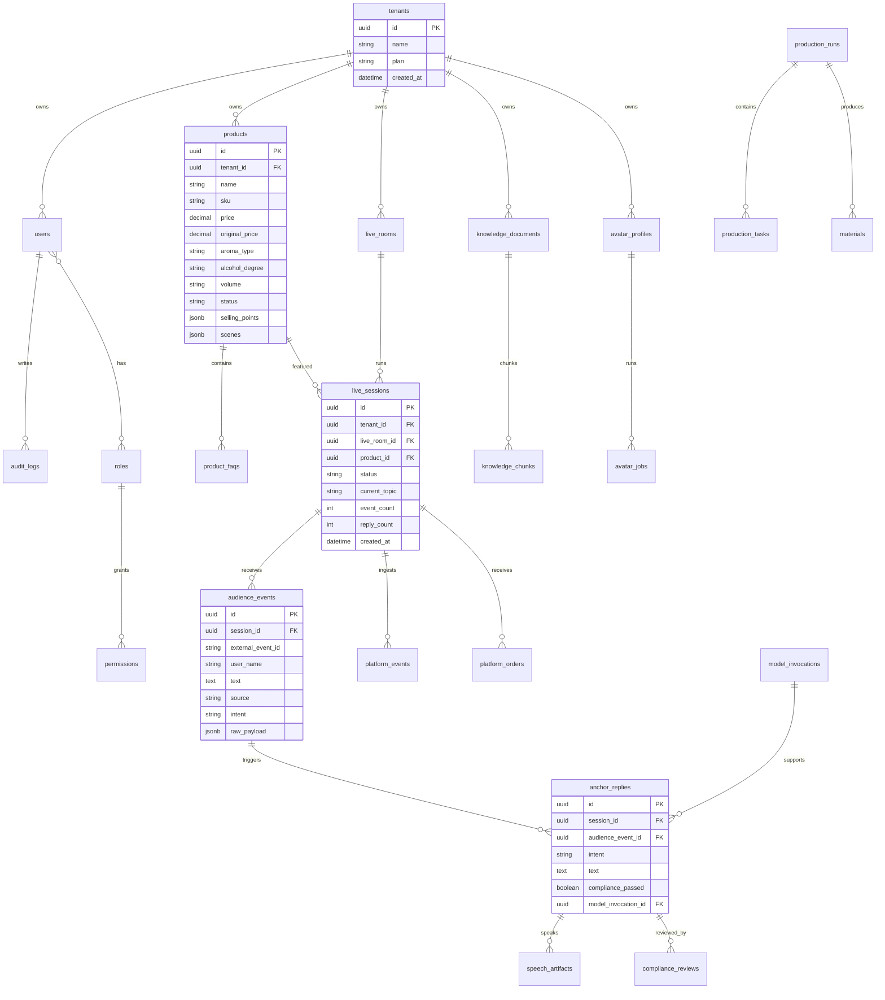

# AI 数字人直播工作台企业架构

## 1. 总体系统架构图



核心原则：

- 第一阶段采用模块化单体，保留微服务边界。
- 直播实时链路使用 Redis/SSE 推送，耗时任务使用 RabbitMQ。
- 所有素材进入 MinIO，所有业务事实进入 PostgreSQL。
- LLM、TTS、Avatar、直播平台均通过 provider adapter 接入。

## 2. 模块架构图

```mermaid
flowchart LR
  subgraph Frontend[运营后台]
    Dashboard[首页数据看板]
    Products[商品中心]
    Rooms[直播间管理]
    Avatars[数字人管理]
    Scripts[话术中心]
    Analytics[数据中心]
    ObsPage[OBS 输出页]
  end

  subgraph Backend[FastAPI 模块化单体]
    APIv1[/api/v1 Routers]
    AppServices[Application Services]
    Domain[Domain Policies & Entities]
    Infra[Infrastructure Adapters]
    AgentGraphs[LangGraph Graphs]
  end

  subgraph InfraLayer[基础设施]
    PG[(PostgreSQL)]
    RD[(Redis)]
    MQ[(RabbitMQ)]
    MV[(Milvus)]
    OS[(MinIO)]
  end

  Frontend --> APIv1
  APIv1 --> AppServices
  AppServices --> Domain
  AppServices --> AgentGraphs
  AppServices --> Infra
  Infra --> InfraLayer
```

## 3. 数据流图

### 3.1 弹幕回复链路



### 3.2 商品知识库链路



## 4. Agent 流程图

### 4.1 主生产链路

```text
商品 → 品牌 → 故事 → 剧本 → 分镜 → 导演 → 视觉导演 → 语音 → 数字人 → 直播间 → 视频 → 推流
```

该链路是 Agent Company、Workflow API 与 `/workflow` 控制台的统一展示顺序。Compliance Agent 是脚本后、视觉导演后和推流前的合规 gate，不插入主链路 lane。

### 4.2 直播弹幕回复链路



## 5. 数据库 ER 图



## 6. API 设计

统一前缀：`/api/v1`

### 首页与指标

- `GET /dashboard/summary`
- `GET /analytics/live-sessions/{session_id}`

### 商品中心

- `GET /products`
- `POST /products`
- `GET /products/{product_id}`
- `PATCH /products/{product_id}`
- `DELETE /products/{product_id}`
- `POST /products/{product_id}/publish`
- `POST /products/{product_id}/unpublish`
- `POST /products/{product_id}/faqs`

### 直播间管理

- `GET /live-rooms`
- `POST /live-rooms`
- `GET /live-rooms/{room_id}`
- `PATCH /live-rooms/{room_id}`
- `POST /live-rooms/{room_id}/bind-avatar`
- `POST /live-rooms/{room_id}/bind-product-pool`

### 直播 Session

- `POST /live/sessions`
- `GET /live/sessions/{session_id}`
- `POST /live/sessions/{session_id}/events`
- `GET /live/sessions/{session_id}/events`
- `GET /live/sessions/{session_id}/events/stream`
- `POST /live/sessions/{session_id}/stop`
- `GET /live/sessions/{session_id}/speech/latest`
- `GET /live/sessions/{session_id}/speech/{artifact_id}/audio`

### 数字人管理

- `GET /avatars`
- `POST /avatars`
- `PATCH /avatars/{avatar_id}`
- `POST /avatars/{avatar_id}/bind-heygen`
- `POST /avatars/{avatar_id}/jobs`
- `GET /avatars/jobs/{job_id}`

### 话术中心

- `GET /scripts/templates`
- `POST /scripts/templates`
- `PATCH /scripts/templates/{template_id}`
- `POST /scripts/templates/generate`

### 知识库

- `POST /knowledge/documents`
- `GET /knowledge/documents`
- `GET /knowledge/documents/{document_id}`
- `POST /knowledge/documents/{document_id}/index`
- `POST /knowledge/search`

### Model Gateway

- `GET /model-gateway/providers`
- `POST /model-gateway/prompts`
- `GET /model-gateway/invocations`

## 7. 项目目录结构

```text
D:/Tavern
  apps/
    api/               # FastAPI 后端
    web/               # Next.js LiveOS 控制台
  packages/            # 共享 domain/config/testing packages
  services/            # model、TTS、avatar、video、RAG、streaming、analytics 边界
  plugins/             # plugin interfaces、manager、loader 和 providers
  workers/             # 后台 workers
  agents/              # 当前活跃 agent 代码；Agent Company 重构稍后进行
  workflows/           # workflow definitions、runners、nodes 和 visual assets
  components/          # 可复用 composition/UI 组件边界
  assets/              # Tavern 自有 raw/processed/generated assets
  shared/              # 跨运行时 shared types/constants/utilities
  legacy/              # 归档的 ViMax 时代文档和废弃资产
  third_party/         # 由 manifest 跟踪的外部 OSS 集成
  docs/
  infra/
  tests/
```

## 8. LangGraph 实现方案

核心图：`LiveAnchorGraph`

状态：

```python
class LiveAnchorState(TypedDict):
    tenant_id: str
    session_id: str
    audience_event_id: str
    event_text: str
    product_context: dict
    intent: str
    retrieved_chunks: list[dict]
    compliance_notes: list[str]
    draft_reply: str
    final_reply: str
    model_invocation_ids: list[str]
    speech_artifact_id: str | None
    errors: list[str]
```

节点：

- 规范化 event
- 识别 intent
- 检索商品知识
- 执行合规前检
- 规划回复策略
- 生成回复
- 执行合规后检
- 持久化回复
- 请求 TTS
- 发布直播 event

失败策略：

- LLM 失败：使用合规兜底回复。
- RAG 失败：仅用结构化商品字段。
- TTS 失败：返回文本与浏览器语音兜底。
- 高风险合规：不调用销售促单，直接安全模板。

## 9. MVP 版本规划

MVP 只做真实可开发闭环：

1. 商品中心 CRUD。
2. 直播间创建/启动/停止。
3. 手动弹幕与 Mock 平台事件。
4. LangGraph 回复生成。
5. 酒类合规前后检。
6. TTS 音频 artifact。
7. OBS 页面。
8. 商品 FAQ RAG。
9. HeyGen dry-run/异步片段 job。
10. PostgreSQL + Redis + RabbitMQ + MinIO compose。
11. 基础 RBAC 与审计。

## 10. V1~V5 迭代路线图

- V1：酒类直播 MVP，后台、商品、直播、OBS、TTS、合规。
- V2：RAG 知识库、话术中心 AI 生成、Model Gateway 成本与 prompt 管理。
- V3：Avatar Service、HeyGen、直播前素材生产、Production Run。
- V4：抖音/淘宝/视频号真实 Adapter、订单/GMV 回流、冷场/下单/关注自动流程。
- V5：多租户 SaaS、计费、Kubernetes 生产部署、插件市场、多行业扩展。

## 11. SaaS 商业化设计

套餐维度：

- 直播间数量
- 数字人数量
- 月度 LLM tokens
- TTS 时长
- Avatar 生成分钟数
- 商品知识库容量
- 平台接入数量
- 团队成员数
- 合规审计保留周期

套餐：

- Starter：单品牌、单直播间、手动平台事件。
- Pro：多直播间、RAG、话术中心、数据分析。
- Business：真实平台接入、Avatar Service、团队协作。
- Enterprise：私有化部署、专属模型网关、合规策略定制、SLA。

## 12. 权限体系设计

角色：

- Owner
- Admin
- Live Operator
- Script Editor
- Compliance Reviewer
- Data Analyst
- Viewer

权限：

- `products:*`
- `live_rooms:*`
- `live_sessions:operate`
- `avatars:*`
- `scripts:*`
- `knowledge:*`
- `analytics:read`
- `compliance:review`
- `settings:model_gateway`
- `platform_accounts:*`

所有敏感操作进入 `audit_logs`。

## 13. Docker 部署方案

Compose 服务：

- `api`：FastAPI
- `worker`：RabbitMQ 消费者
- `web`：Next.js
- `postgres`
- `redis`
- `rabbitmq`
- `minio`
- `milvus`：RAG 阶段启用

本地开发：

```bash
docker compose -f infra/docker/docker-compose.yml up --build
```

健康检查：

- API `/health`
- API `/ready`
- Web `/`
- MinIO console
- RabbitMQ management

## 14. Kubernetes 部署方案

资源：

- `api-deployment.yaml`
- `worker-deployment.yaml`
- `web-deployment.yaml`
- `api-service.yaml`
- `web-service.yaml`
- `ingress.yaml`
- `configmap.yaml`
- `secret.example.yaml`
- `hpa.yaml`
- `pdb.yaml`
- `networkpolicy.yaml`

生产建议：

- PostgreSQL 使用云数据库或 Operator。
- MinIO 可外置对象存储。
- RabbitMQ/Redis 使用托管服务或 Operator。
- Milvus 单独部署并配置持久化。
- Secret 使用 External Secrets Operator。
- 所有服务启用就绪检查和存活检查。
