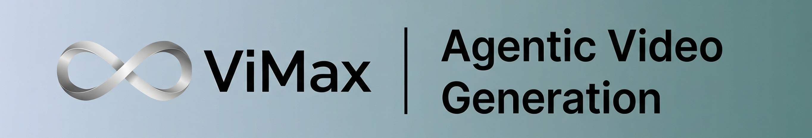

<div align="center">
   
  <br>
  <br>
  <a href="https://trendshift.io/repositories/15299" target="_blank"></a>
  <h1 align="center">ViMax：智能体视频生成</h1>

  <p align="center">
    
    <a href="https://github.com/astral-sh/uv"></a>
    
  </p>

  <p align="center">
    <a href="./Communication.md"></a>
    <a href="./Communication.md"></a>
  </p>

  <p align="center">
    <a href="https://www.youtube.com/@AI-Creator-is-here"></a>
    <a href="https://arxiv.org/abs/2606.07649"></a>
  </p>

  <p align="center">
    <a href="#快速开始" style="text-decoration: none;"></a>
  </p>
</div>

---

### 🚨 当前视频生成限制

- ❌ **只能生成短片段**：多数 AI 工具只能生成几秒视频。<br>
- ❌ **一致性混乱**：角色和场景会在不同帧之间不可预测地变化。<br>
- ❌ **只关注画面**：缺少脚本、音频、叙事结构和故事深度。<br>

### 💡 ViMax 方案

🎬 **导演**、**编剧**、**制片**和**视频生成器**一体化。ViMax 探索的是 AI 成为完整创意生产力的未来：你只需输入概念，系统会自主完成脚本编写、分镜设计、角色生成与最终视频生成，实现端到端编排。🚀

https://github.com/user-attachments/assets/5bad46b2-8276-4e1d-9480-3522640744b2

---

## 📑 目录

- [💡 核心特性](#-核心特性)
- [🔮 从零生成的视频演示](#-从零生成的视频演示)
- [🎯 端到端视频创作引擎](#-端到端视频创作引擎)
- [🔥 为什么选择 ViMax](#-为什么选择-vimax)
- [🏗️ 系统架构](#️-系统架构)
- [🚀 快速开始](#-快速开始)

---

## 💡 核心特性

<table align="center" width="100%" style="border: none; table-layout: fixed;">
<tr>
<td width="25%" align="center" style="vertical-align: top; padding: 20px;">

<div style="height: 80px; display: flex; align-items: center; justify-content: center;">
<h3 style="margin: 0; padding: 0;">🌟 <strong>Idea2Video</strong></h3>
</div>

<div align="center" style="margin: 15px 0;">
  
</div>

<div style="height: 80px; display: flex; align-items: center; justify-content: center;">
<p align="center"><strong>从灵感到银幕</strong></p>
</div>

<div style="height: 60px; display: flex; align-items: center; justify-content: center;">
<p align="center">通过智能多智能体工作流，将<strong>原始创意</strong>转化为完整视频故事，并自动化完成<strong>叙事构建、角色设计与制作</strong>。</p>
</div>

</td>
<td width="25%" align="center" style="vertical-align: top; padding: 20px;">

<div style="height: 80px; display: flex; align-items: center; justify-content: center;">
<h3 style="margin: 0; padding: 0;">🎨 <strong>Novel2Video</strong></h3>
</div>

<div align="center" style="margin: 15px 0;">
  
</div>

<div style="height: 80px; display: flex; align-items: center; justify-content: center;">
<p align="center"><strong>智能文学改编引擎</strong></p>
</div>

<div style="height: 60px; display: flex; align-items: center; justify-content: center;">
<p align="center">将<strong>完整小说</strong>转化为<strong>分集视频内容</strong>，支持叙事压缩、角色追踪和逐场景视觉化改编。</p>
</div>

</td>
<td width="25%" align="center" style="vertical-align: top; padding: 20px;">

<div style="height: 80px; display: flex; align-items: center; justify-content: center;">
<h3 style="margin: 0; padding: 0;">⚙️ <strong>Script2Video</strong></h3>
</div>

<div align="center" style="margin: 15px 0;">
  
</div>

<div style="height: 80px; display: flex; align-items: center; justify-content: center;">
<p align="center"><strong>不受限制的剧本视频创作</strong></p>
</div>

<div style="height: 60px; display: flex; align-items: center; justify-content: center;">
<p align="center">从个人故事到史诗冒险，创作者可以编写<strong>任意剧本</strong>，并完整掌控视觉叙事的每个环节。</p>
</div>

</td>
<td width="25%" align="center" style="vertical-align: top; padding: 20px;">

<div style="height: 80px; display: flex; align-items: center; justify-content: center;">
<h3 style="margin: 0; padding: 0;">🤳 <strong>AutoCameo</strong></h3>
</div>

<div align="center" style="margin: 15px 0;">
  
</div>

<div style="height: 80px; display: flex; align-items: center; justify-content: center;">
<p align="center"><strong>用你的照片生成视频</strong></p>
</div>

<div style="height: 60px; display: flex; align-items: center; justify-content: center;">
<p align="center"><strong>创建自己的客串视频</strong>，把自己或宠物变成故事角色，出现在无限创意剧本、电影镜头与互动剧情中。</p>
</div>

</td>
</tr>
</table>

---

## 🔮 从零生成的视频演示

<table>
<tr>
<td align="center" width="33%"><video src="https://github.com/user-attachments/assets/c2fb27b0-218c-4976-b3d6-2abf8ea06be7" controls width="100%"></video></td>
<td align="center" width="33%"><video src="https://github.com/user-attachments/assets/bfa566a8-688d-4d53-a9e2-6cedeb4a399d" controls width="100%"></video></td>
<td align="center" width="33%"><video src="https://github.com/user-attachments/assets/49f61134-4f78-4285-9a9e-bb5e3e0c4abf" controls width="100%"></video></td>
</tr>
<tr>
<td align="center" width="33%"><video src="https://github.com/user-attachments/assets/a950f449-a15c-449b-a1b8-c393951aa9be" controls width="100%"></video></td>
<td align="center" width="33%"><video src="https://github.com/user-attachments/assets/bb3ff0fd-9433-4806-886a-3f77b61d06ec" controls width="100%"></video></td>
<td align="center" width="33%"><video src="https://github.com/user-attachments/assets/2624a3f0-9f66-4fa4-b527-45c0ea0353fc" controls width="100%"></video></td>
</tr>
<tr>
<td align="center" width="33%"><video src="https://github.com/user-attachments/assets/5dbb80f7-aff0-4211-940c-a898f91fb80c" controls width="100%"></video></td>
<td align="center" width="33%"><video src="https://github.com/user-attachments/assets/cc0b0bcd-e7db-4839-950b-0b03949637bd" controls width="100%"></video></td>
<td align="center" width="33%"><video src="https://github.com/user-attachments/assets/85919b59-80f0-461a-af7e-a93d3fb412fc" controls width="100%"></video></td>
</tr>
</table>

---

### 🎯 **端到端视频创作引擎**

**核心挑战**：

- 🌅 **参考图像**：获取、组织并对齐能够准确表达角色、物体、位置和环境的参考帧非常耗时。
- 🫠 **一致性检查**：即使给出正确的角色、位置、环境参考图和提示词，图像生成器也可能产出不可用图像。
- 📄 **脚本生成**：专业高质量视频需要丰富的信息密度和结构化设计。
- 📝 **分镜设计**：将故事转化为视觉叙事需要摄影、构图与视觉叙事经验。
- 🎬 **镜头设计**：复杂场景中需要保持叙事流动，同时设计合理角度、转场和节奏。
- 🎨 **开发延迟**：长视频中数百个镜头都要保持角色外观、环境和艺术风格一致。
- ⏱️ **生产效率**：传统视频创作依赖多位专业人员与长流程，不利于独立创作者和快速原型。
- 🎥 **AI 生成视频扩展**：分钟级甚至小时级高质量长视频需要跨场景连续性、多分镜设计和处理能力。

**ViMAX** 通过自动化从叙事输入到最终视频输出的完整流水线，消除这些生产瓶颈。

---

### 🔥 **为什么选择 ViMax？**

| 🧠 **轻松生产** | 🚀 **完整创作自由** | 🔊 **音画绑定** | 🎨 **专业质量** | 🤩 **互动视频** |
|:---:|:---:|:---:|:---:|:---:|
| 一句话生成成片 | 任意叙事都可落地 | 同步叙事体验 | 电影级输出 | 制作自己的客串视频 |
| 跳过技术复杂度，只需描述愿景，ViMax 负责脚本生成、分镜、镜头设计、参考管理和一致性校验。 | 无创意边界：预告片、短篇故事、小说章节或原创概念都可被结构化并转化为镜头语言。 | 将角色语音与音效无缝融入视觉内容，形成沉浸式体验。 | 自动质量控制确保角色一致、场景构图合理、每帧符合专业视觉标准。 | 上传照片即可在自己的短故事中出演，ViMax 会保持角色外观和自然互动一致。 |

ViMax 还包含 **Agents Loop + TUI** 工作流，支持交互式规划、修订、渲染控制、session 复用和上下文压缩，同时保留原有直接 pipeline 入口。

---

### ☄️ **即将推出 / 已完成**

- 👨‍💻 **Google AI Studio API config✅**
- 🤖 **Agents Loop + TUI✅**
- 📄 **Technical Report✅**

---

## 🏗️ 系统架构

### 📊 **系统概览**

**ViMax** 是多智能体视频框架，可在保障角色和场景一致性的同时自动生成多镜头视频。系统将创意转译为视频，让你专注讲故事，而不是处理技术实现。

🎯 **技术能力**：

🧬 **智能长脚本生成**
基于 RAG 的长脚本设计引擎会分析小说级长文本，并自动拆分为多场景脚本格式，确保关键情节和角色对白被准确保留。

🪄 **表现力分镜设计**
镜头级分镜系统基于用户需求和目标受众，用电影语言生成表现力分镜，为后续视频生成建立叙事节奏。

🔮 **多机位拍摄模拟**
模拟多机位拍摄，在同一场景内保持角色位置和背景一致，并提供更沉浸的观看体验。

🧸 **智能参考图选择**
自动选择当前视频首帧所需参考图，包括前序时间线中的分镜，确保长视频中的多角色和环境元素准确衔接。

⚙️ **自动化图像生成**
基于所选参考图和前序时间线的视觉逻辑，自动生成图像提示词，合理安排角色与环境的空间交互。

✅ **自动化图像一致性检查**
并行生成多张图像，再通过 MLLM/VLM 选择最一致的图像作为首帧，模拟人工创作者工作流。

⚡ **高效并行镜头生成**
对同一机位的连续镜头进行并行处理，显著提升视频生产效率。

### 🤖 <strong>多智能体视频生成流水线</strong>

<div align="center">
  <table align="center" width="100%" style="border: none; border-collapse: collapse;">
    <tr>
      <td colspan="3" align="center" style="padding: 20px; background: linear-gradient(135deg, #667eea 0%, #764ba2 100%); border-radius: 15px; color: white; font-weight: bold;">
        🧠 <strong>输入层</strong><br/>
        📝 创意、剧本和小说 • 💭 自然语言提示 • 🖼️ 参考图像 • 🎨 风格指令 • 🧩 配置
      </td>
    </tr>
    <tr><td colspan="3" height="20"></td></tr>
    <tr>
      <td colspan="3" align="center" style="padding: 15px; background: linear-gradient(135deg, #ff6b6b 0%, #ee5a24 100%); border-radius: 12px; color: white; font-weight: bold;">
        🧭 <strong>中央编排</strong><br/>
        Agent 调度 • 阶段切换 • 资源管理 • 重试/降级逻辑
      </td>
    </tr>
    <tr><td colspan="3" height="15"></td></tr>
    <tr>
      <td align="center" style="padding: 12px; background: linear-gradient(135deg, #3742fa 0%, #2f3542 100%); border-radius: 10px; color: white; width: 50%;">
        🧾 <strong>脚本理解</strong><br/>
        <small>角色/环境提取 • 场景边界 • 风格意图</small>
      </td>
      <td width="10"></td>
      <td align="center" style="padding: 12px; background: linear-gradient(135deg, #8c7ae6 0%, #9c88ff 100%); border-radius: 10px; color: white; width: 50%;">
        🎥 <strong>场景与镜头规划</strong><br/>
        <small>分镜步骤 • 镜头列表 • 关键帧和节奏点</small>
      </td>
    </tr>
    <tr><td colspan="3" height="15"></td></tr>
    <tr>
      <td colspan="3" align="center" style="padding: 15px; background: linear-gradient(135deg, #00d2d3 0%, #54a0ff 100%); border-radius: 12px; color: white; font-weight: bold;">
        🧪 <strong>视觉资产规划</strong><br/>
        参考图选择 • 外观/风格指导 • 提示词条件化
      </td>
    </tr>
    <tr><td colspan="3" height="15"></td></tr>
    <tr>
      <td align="center" style="padding: 12px; background: linear-gradient(135deg, #e056fd 0%, #f368e0 100%); border-radius: 10px; color: white; width: 50%;">
        🗂️ <strong>资产索引</strong><br/>
        <small>帧/参考图目录 • Embeddings • 复用检索</small>
      </td>
      <td width="10"></td>
      <td align="center" style="padding: 12px; background: linear-gradient(135deg, #ffa726 0%, #ff7043 100%); border-radius: 10px; color: white; width: 50%;">
        ♻️ <strong>一致性与连续性</strong><br/>
        <small>角色/环境追踪 • 参考匹配 • 时间连贯性</small>
      </td>
    </tr>
    <tr><td colspan="3" height="15"></td></tr>
    <tr>
      <td colspan="3" align="center" style="padding: 15px; background: linear-gradient(135deg, #26de81 0%, #20bf6b 100%); border-radius: 12px; color: white; font-weight: bold;">
        ✂️ <strong>视觉合成与组装</strong><br/>
        图像生成 • 最佳帧选择 • 首/尾帧到视频 • 剪辑与时间线组装
      </td>
    </tr>
    <tr><td colspan="3" height="15"></td></tr>
    <tr>
      <td colspan="3" align="center" style="padding: 20px; background: linear-gradient(135deg, #045de9 0%, #09c6f9 100%); border-radius: 15px; color: white; font-weight: bold;">
        🚀 <strong>输出层</strong><br/>
        🖼️ Frames • 🎞️ Clips 和最终视频 • 📜 Logs • 📦 Working Directory Artifacts
      </td>
    </tr>
  </table>
</div>

## 🚀 快速开始

### 🖥️ **环境**

```text
OS: Linux, Windows
```

### 📥 **克隆与安装**

ViMax 使用 uv 管理环境。uv 安装方式请参考 https://docs.astral.sh/uv/getting-started/installation/。

```bash
git clone https://github.com/HKUDS/ViMax.git
cd ViMax
uv sync
```

### 🧠 **交互式 Agent TUI / Agents Loop**

ViMax 提供最小化 TUI，用于交互式 agent 视频创作。在 ViMax 根目录启动前，请先在 `configs/agent.local.yaml` 中配置 LLM、image 和 video providers。

```bash
vimax tui
```

新建 session 或恢复已有 session：

```bash
vimax tui new
vimax tui resume
vimax tui resume <session_id>
```

### 🎯 **使用方式**

`main_idea2video.py` 用于把创意转换成视频。你需要在 `configs/idea2video.yaml` 中配置 model 与 API key 信息，包括 chat model、image generator 和 video generator 三部分，例如：

```yaml
chat_model:
  init_args:
    model: google/gemini-2.5-flash-lite-preview-09-2025
    model_provider: openai
    api_key: <YOUR_API_KEY>
    base_url: https://openrouter.ai/api/v1

image_generator:
  class_path: tools.ImageGeneratorNanobananaGoogleAPI
  init_args:
    api_key: <YOUR_API_KEY>

video_generator:
  class_path: tools.VideoGeneratorVeoGoogleAPI
  init_args:
    api_key: <YOUR_API_KEY>

working_dir: .working_dir/idea2video
```

然后在 `main_idea2video.py` 中提供简洁但有思考的创意，以及对应创作要求：

```python
idea = \
"""
If a cat and a dog are best friends, what would happen when they meet a new cat?
"""
user_requirement = \
"""
For children, do not exceed 3 scenes.
"""
style = "Cartoon"
```

`main_script2video.py` 会基于具体剧本生成视频。你同样需要先在 `configs/script2video.yaml` 中配置 API，然后在 `main_script2video.py` 中提供场景剧本和创作要求：

```python
script = \
"""
EXT. SCHOOL GYM - DAY
A group of students are practicing basketball in the gym. The gym is large and open, with a basketball hoop at one end and a large crowd of spectators at the other end. John (18, male, tall, athletic) is the star player, and he is practicing his dribble and shot. Jane (17, female, short, athletic) is the assistant coach, and she is helping John with his practice. The other students are watching the practice and cheering for John.
John: (dribbling the ball) I'm going to score a basket!
Jane: (smiling) Good job, John!
John: (shooting the ball) Yes!
...
"""
user_requirement = \
"""
Fast-paced with no more than 20 shots.
"""
style = "Animate Style"
```

---

**🌟 如果这个项目对你有帮助，欢迎给我们一个 Star！**

<p align="center">
  <em> ❤️ 感谢访问 ✨ ViMax！</em><br><br>
</p>
